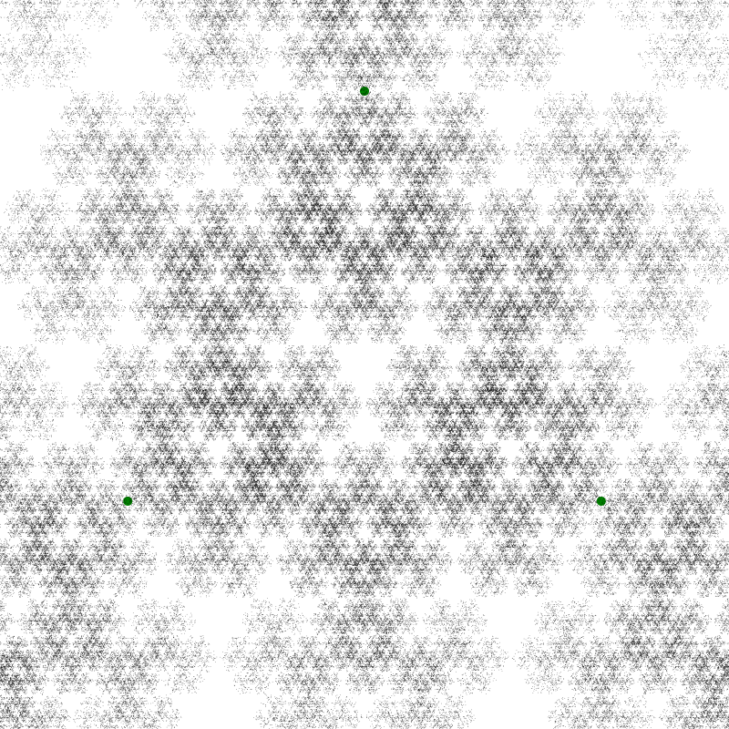
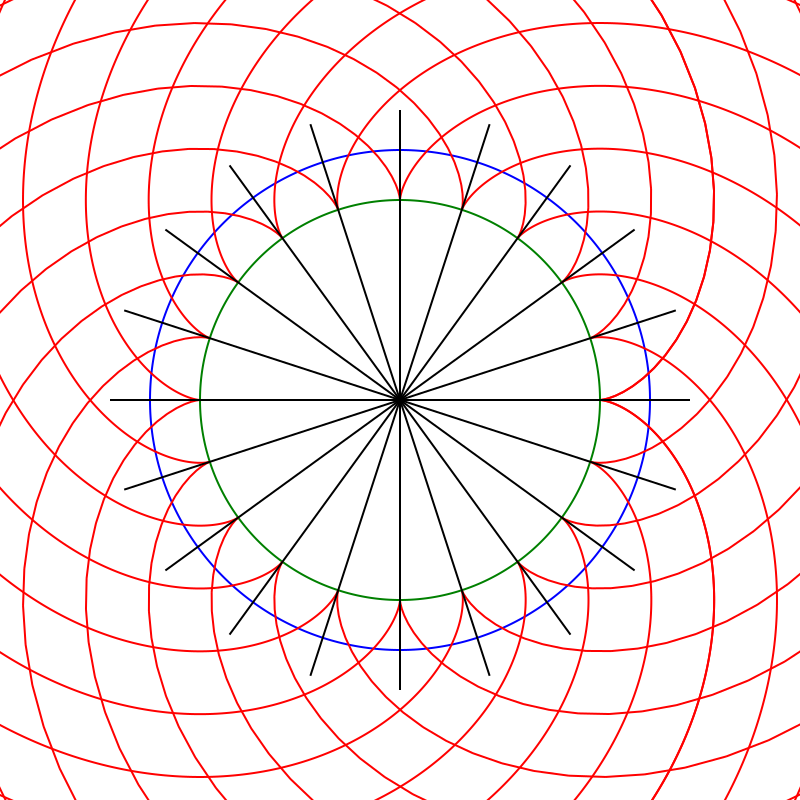
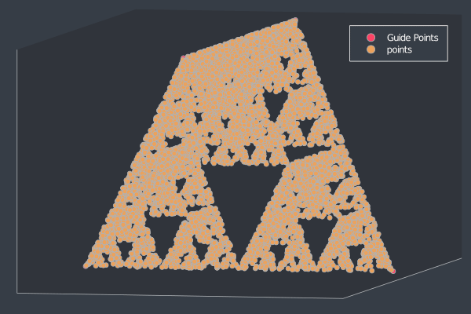
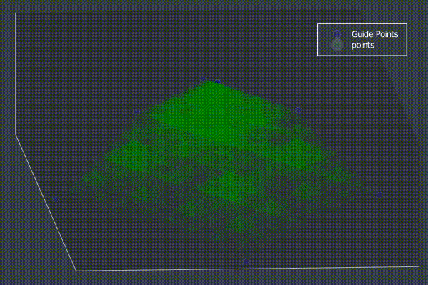
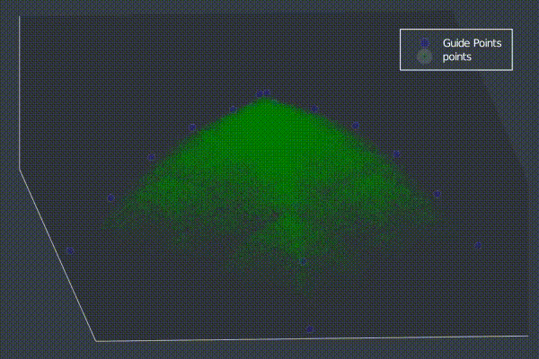

# LuxorT

## 2D 

[Luxor.jl](https://github.com/JuliaGraphics/Luxor.jl) 2D graphics experimenting see [Luxorfun.ipynb](Luxorfun.ipynb)

Containing:
- a 2D [Chaos Game](https://en.wikipedia.org/wiki/Chaos_game) implementation.

- an implementation of a [circular involute](https://en.wikipedia.org/wiki/Involute#Involutes_of_a_circle).

Inspired by the [Tangential Art Video](https://www.youtube.com/watch?v=9TvpOzPKcy4).

Inspired by the [Branched FLow Paper](https://www.youtube.com/watch?v=UNCNp1tBqKY)

Inspired by the concept of a [Phased Array](https://en.wikipedia.org/wiki/Phased_array). See [PhasedArray/PhasedArrayBlends.jl](PhasedArray/PhasedArrayBlends.jl
).

## 3D 

Implementation of the [Chaos Game](https://en.wikipedia.org/wiki/Chaos_game) using [Plots.jl](https://github.com/JuliaPlots/Plots.jl) to be found in [3dFun.jl](3dFun.jl)

### Tetrahedron

### Approximate Paraboloid

